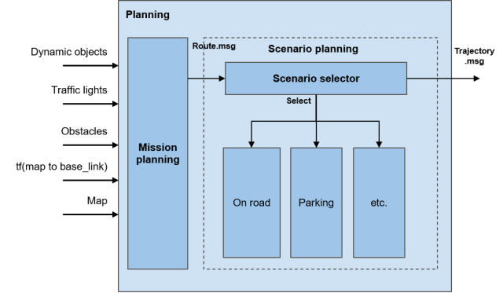
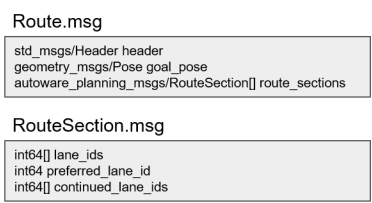
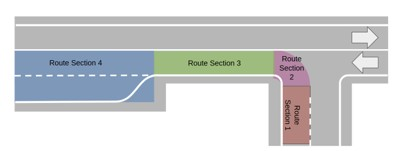

Planning
=============

# Overview 

Planning stack acts as the “brain” of autonomous driving. It uses all the results from Localization, Perception, and Map stacks to decide its maneuver and gives final trajectory to Control stack. 

## Role
These are high-level roles of Planning stack:

- Calculates route that navigates to desired goal
- Plans trajectory to follow the route
  - Make sure that vehicle does not collide with obstacles, including pedestrians and other vehicles)
  - Make sure that the vehicle follows traffic rules during the navigation. This includes following traffic light, stopping at stoplines, stopping at crosswalks, etc. 
- Plan sequences of trajectories that is feasible for the vehicle. (e.g. no sharp turns that is kinematically impossible)

## Use Cases
Planning stack must satisfy following use cases:

1. Navigate vehicle from start to goal
2. Operating lane change
3. Driving along lane
4. Following speed limit of lane
5. Follow traffic light
6. Follow yield/stop signs
7. Turning left/right at intersections
8. Park vehicle at parking space (either reverse parking or forward first parking)

## Requirements

1. **Planing route from start to goal**  (Use Case 1)
    * Planning stack should be able to get starting lane and goal lane from given start pose and goal pose either in earth frame or map frame
    * Planning stack should be able to calculate sequences of lanes that navigates vehicle from start lane to goal lane that minimizes cost function(either time based cost or distance based cost) 

2. **Driving along lane** (Use Case 2)
    * Vehicle must drive between left boundary and right boundary of driving lane
    * The vehicle must have at least 2 seconds margin between other vehicles so that it has enough distance to stop without collision. [reference](https://www.cedr.eu/download/Publications/2010/e_Distance_between_vehicles.pdf)

3. **Operating lane change** (Use Case 3)
    * Vehicle must change lane when
        * lane change is necessary to follow planned route
        * If current driving lane is blocked (e.g. by parked vehicle)
    * Vehicle must turn on appropriate turn signal 3 seconds before lane change and it must be turned on until lane change is finished
    * Vehicle should stay in lane at least for 3 second before operating lane change for other participants to recognize ego vehicle's turn signal.
    * there must be 2 seconds margin between any other vehicles during lane change
    * lane change finishes 30m before any intersections
    * vehicle should abort lane change when all of the following conditions are satisfied:
        * Vehicle(base_link) is still in the original lane
        * there is no longer 2 seconds margin between other n vehicles during lane change e.g. due to newly detected vehicles

4. **Follow speed limit of lane** (Use Case 4)
    * Speed profile of trajectory points in a lane must be below speed limit of the lane.

5. **Follow traffic light** (Use Case 5)
    * Planning stack should refer to Perception output of the traffic light associated to driving lane.
    * Speed profile of a trajectory at the associated stopline must be zero when relevant traffic light is red and it has enough distance to stop before the stopline with given deceleration configuration

6. **Turning left/right at intersections** (Use Case 6)
    * Vehicle must stop before entering intersection whenever other vehicles are entering intersection unless ego vehicle has right of way

7. **Parking** (Use Case 7)
    * Vehicle must not hit other vehicle, curbs, or other obstacle during parking
        * i.e. All points in planned trajectory has enough distance from other objects with ego vehicle's footprint taken into account

8. **General requirements to trajectory**
    * Planned trajectory must satisfy requirements from Control stack:
        * Planned trajectory must have speed profile that satisfies given acceleration and jerk limits unless vehicle is under emergency e.g. when pedestrian suddenly jumps into driving lane or front vehicle suddenly stops.
        * Planned trajectory must be feasible by the given vehicle kinematic model
        * Planned trajectory must satisfy given lateral acceleration and jerk limit
        * Planned trajectory points within *n* [m] from ego vehicle should not change over time unless sudden steering or sudden acceleration is required to avoid collision with other vehicles.
            * *n*[m] = *velocity_of_ego_vehicle* * *configured_time_horizon*

## Input

The table below summarizes the overall input into Planning stack:

| Input                           | Topic Name(Data Type)                                                                                                   | Explanation                                                                                                                                                                                                                                                                                                         |
| ------------------------------- | ----------------------------------------------------------------------------------------------------------------------- | ------------------------------------------------------------------------------------------------------------------------------------------------------------------------------------------------------------------------------------------------------------------------------------------------------------------- |
| Vehicle Pose                    | `/tf (map->base_link)` (`tf::tfMessage`)                                                                             | Planning requires vehicle pose in map frame, which is the frame where all planning takes place.                                                                                                                                                                                                                     |
| Vehicle Velocity                | `/localization/twist` (`geometry_msgs::Twist`)                                                                       | This includes vehicle's velocity information. It is used to predict future pose on trajectory to detect collision with other objects.                                                                                                                                                                               |
| Map data                        | `/map/vector_map` (`autoware_lanelet2_msgs::LaneletMapBin`)                                                          | This includes all static information about the environment, such as: <ul><li>Lane connection information used for route planning from starting position to goal position</li><li>Lane geometry to generate reference path used to calculate trajectory </li><li> All information related to traffic rules</li></ul> |
| Detected Obstacle Information   | `/perception/object_recognition/objects` (`autoware_planning_msgs::DynamicObjectsArray`)                             | This includes information that cannot be known beforehand such as pedestrians and other vehicles. Planning stack will plan maneuvers to avoid collision with such objects.                                                                                                                                          |
| Goal position                   | `/planning/goal_pose` (`geometry_msgs::PoseStamped`)                                                                 | This is the final pose that Planning stack will try to achieve.                                                                                                                                                                                                                                                     |
| TrafficLight recognition result | `/perception/traffic_light_recognition/traffic_light_states` (`autoware_traffic_light_msgs::TrafficLightStateArray`) | This is the real time information about the state of each traffic light. Planning stack will extract the one that is relevant to planned path and use it to decide whether to stop at intersections.                                                                                                                |

## Output

The table below summarizes the final output from Planning stack:

| Output      | Topic(Data Type)                                                    | Explanation                                                                                                                                                |
| ----------- | ------------------------------------------------------------------- | ---------------------------------------------------------------------------------------------------------------------------------------------------------- |
| Trajectory  | `/planning/trajectory` (`autoware_planning_msgs::Trajectory`)    | This is the sequence of pose that Control stack must follow. This must be smooth, and kinematically possible to follow by the Control stack.               |
| Turn Signal | `/vehicle/turn_signal_cmd` (`autoware_vehicle_msgs::TurnSignal`) | This is the output to control turn signals of the vehicle. Planning stack will make sure that turn signal will be turned on according to planned maneuver. |

# Design

In order to achieve the requirements stated above, Planning stack is decomposed into the diagram below. 
Each requirement is met in following modules:

* Requirement 1: Mission calculates the overall route to reach goal from starting position 
* Requirement 2-7: LaneDriving scenario plans trajectory along lanes in planned route
* Requirement 8: Parking scenario plans trajectory in free space to park into parking space 
* Requirement 9: Both LaneDriving and Parking should output trajectory that satisfies the requirement

We have looked into different autonomous driving stacks and concluded that it is technically difficult to use unified planner to handle every possible situation. (See [here](DesignRationale.md) for more details). Therefore, we have decided to set different planners in parallel dedicated for each use case, and let scenario selector to decide depending on situations. Currently, we have reference implementation with two scenarios, on-road planner and parking planner, but any scenarios (e.g. highway, in-emergency, etc.) can be added as needed. 

It may be controversial whether new scenario is needed or existing scenario should be enhanced when adding new feature, and we still need more investigation to set the definition of “Scenario” module.

## Mission planner

### Role
The role of mission planner is to calculate route that navigates from current vehicle pose to goal pose. The route is made of sequence of lanes that vehicle must follow to reach goal pose. 

This module is responsible for calculating full route to goal, and therefore only use static map information. Any dynamic obstacle information (e.g. pedestrians and vehicles) is not considered during route planning. Therefore, output route topic is only published when goal pose is given and will be latched until next goal is provided.

**remark**: Dynamic map information, such as road construction blocking some lanes, may be considered in the future. However, this feature becomes more reasonable unless we have multiple vehicle, where each vehicle updates map online and share it with other vehicles. Therefore, we only consider static map information for now.

### Input

- current pose: `/tf` (map->base_link):   This is current pose in map frame calculated by Localization stack.
- goal pose: geometry_msgs::PoseStamped   This is goal pose given from the Operator/Fleet Management Software
- map: autoware_lanelet_msgs::MapBin   This is binary data of map from Map stack. This should include geometry information of each lane to match input start/goal pose to corresponding lane, and lane connection information to calculate sequence of lanes to reach goal lane.

### Output

route: `autoware_planning_msgs::Route`   Message type is described below. Route is made of sequence of route section that vehicle must follow in order to reach goal, where a route section is a “slice” of a road that bundles lane changeable lanes. Note that the most atomic unit of route is lane_id, which is the unique id of a lane in vector map. Therefore, route message does not contain geometric information about the lane since we did not want to have planning module’s message to have dependency on map data structure.

## Scenario selector
### Role

The role of scenario selector is to select appropriate scenario planner depending on situation. For example, if current pose is within road, then scenario selector should choose on-road planner, and if vehicle is within parking lot, then scenario selector should choose parking scenario.
Note that all trajectory calculated by each scenario module passes is collected by scenario selector, and scenario selector chooses which trajectory to be passed down to Control module. This ensures that trajectory from unselected scenario is not passed down to Control when scenario is changed even if there is a delay when scenario planner receives notification that it is unselected by the scenario selector. 

### Input

- map: `autoware_lanelet_msgs::MapBin`
- vehicle pose: `/tf` (map->base_link)
- route: `autoware_planning_msgs::Route`   Scenario planner uses above three topics to decide which scenario to use. In general it should decide scenarios based on where in the map vehicle is located(map+vehicle pose) and where it is trying to go(route).
- trajectory: `autoware_planning_msgs::Trajectory`   Scenario planner gets the output from all the scenarios and passes the trajectory from selected scenario down to following stacks. This must be done within scenario_selector module to sync with the timing of scenario changing.

### Output

- scenario: `autoware_planning_msgs::Scenario`   This contains current available scenario and selected scenario. Each Scenario modules read this topic and chooses to plan trajectory
- Trajectory: `autoware_planning_msgs::Trajectory`   This is the final trajectory of Planning stack, which is the trajectory from selected Scenario module.  

## Scenarios 

### Role

The role of Scenario module is to calculate trajectory message from route message. It should only plan when the module is selected by the scenario selector module. This is where all behavior planning is done.

### Input

- Route: `autoware_planning_msgs::Route`   This includes the final goal pose and which lanes are available for trajectory planning.
- Map: `autoware_lanelet_msgs::MapBin`   This provides all static information about the environment, including lane connection, lane geometry, and traffic rules. Scenario module should plan trajectory such that vehicle follows all traffic rules specified in map.
- Dynamic Objects: `autoware_perception_msgs::DynamicObjectArray`   This provides all obstacle information calculated from sensors. Scenario module should calculate trajectory such that vehicle does not collide with other objects. This can be either done by planning velocity so that it stops before hitting obstacle, or by calculate path so that vehicle avoids the obstacle.
- Scenario: `autoware_planning_msgs::Scenario`   This is the message from scenario selector. Scenario modules only run when the module is selected by this topic.

### Output

- Trajectory: `autoware_planning_msgs::Trajectory`   This contains trajectory that Control must follow. The shape and velocity of the trajectory must satisfy all the use cases for the scenario module.
- Turn Signal: `autoware_vehicle_msgs::TurnSignal`   Turn signal command should also be published because Scenario module is only aware of the traffic rules and operating maneuvers in the whole Autoware stack.
